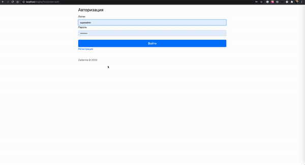

# zadarma
PHP Engine for Zadarma

Simple PHP engine for your project
You can uses it for fast create 
You can to add composer and include it in index.php

Uses MVC

For to init:
session_start();
define('CONSTRUCTOR_PATH', dirname(__FILE__));
require_once(CONSTRUCTOR_PATH.'/core.php');

$this->core->models // Access for all models 
$this->core->controllers // Access for all controllers
$this->core->libraries // Access for all libraries

For create controller:
1. In folder "./controllers" create file "controller.NAME_CONTROLLER.php"
2. Fill in the file:
class controller_NAME_CONTROLLER extends extController {
    function show() {
        $this->core->libraries->views->show(CONSTRUCTOR_PATH . '/views/NAME_VIEW.tpl', array(
          'hello' => 'just'
        ));
    }
}
3. In folder "./views" create file "NAME_VIEW.tpl"
4. In "NAME_VIEW.tpl" you can to use $vars, for example:
<?php
  print $vars['hello'];
?>
5. From controller_NAME_CONTROLLER you can access to $this->core->models, $this->core->controllers, $this->core->libraries
6. In view you can access to $this->core->models, $this->core->controllers, $this->core->libraries
7. You can access to the controller: $this->core->models->NAME_LIBRARY

For create model:
1. In folder "./models" create file "model.NAME_MODEL.php"
2. Fill in the file:
class model_NAME_MODEL extends extModel {
}
3. From model_NAME_MODEL you can access to $this->core->models, $this->core->controllers, $this->core->libraries
4. You can access to the model: $this->core->models->NAME_LIBRARY

For create library:
1. In folder "./libraries" create file "libraru.NAME_LIBRARY.php"
2. Fill in the file:
class library_NAME_LIBRARY {
}
3. You can access to the library: $this->core->libraries->NAME_LIBRARY

--
URL
--

index.php?controller=NAME_CONTROLLER // To run method show in controller
index.php // Default controller "controller.auth.php"
